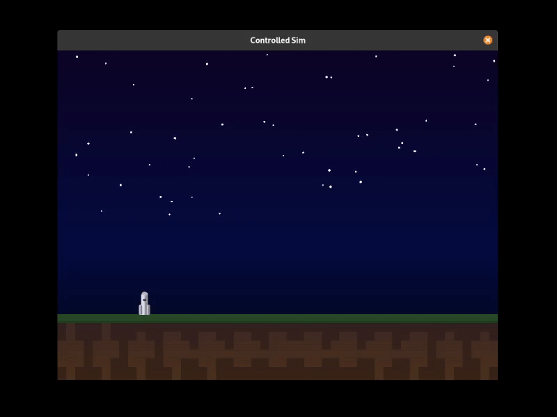

# tvc-lander



A Proximal Policy Optimization (PPO) agent trained to land a rocket using thrust vector controls. The gym environment is built in Rust using `macroquad` and `rapier2d` and is inspired by the LunarLander task. The landing task has been modified to have continuous control instead of a discrete action space and to be a bit simpler (fixed landing zone, flat land).

## Live Demo

A live demo of the PPO agent is available [here](https://akkshay0107.github.io/tvc-lander/). The demo is a WASM build of the `controlled_sim` binary. The model is still a work in progress (the task is a lot harder than I initially expected).

## Features

- A physics simulator of the lander and thrust vector controls using `rapier2d`.
- FFI Python bindings from the Rust simulation using `pyo3` to create a gym module for training.
- PPO reinforcement learning agent trained using Python and PyTorch.
- Curriculum learning for training the PPO agent.
- Interactive simulation with random start positions and mouse click-and-drag to reposition the rocket.
- Model inference in Rust (for the controlled simulation) using the ONNX runtime.
- WASM build for running the simulation in the browser.

## PPO Model

### Observation Space

The observation space is a 6-dimensional vector (since the sim is only in 2D) containing the following in order:

- $x, y$: The x and y coordinates of the rocket in the world.
- $\theta$: The angle of the rocket from the vertical.
- $v_x, v_y$: The linear velocity of the rocket in the x and y directions.
- $\omega$: The angular velocity of the rocket.

The observations are roughly normalized to the range $[-1, 1]$ before being passed to the model. The true physical dimensions of the scene are 80 x 60, with the rocket being 2 x 4 in the same units.

### Action Space

The action space is a 2D vector representing standard thrust vector controls:

- $F_{\text{thrust}}$: The amount of thrust to apply, normalized to the range [-1, 1].
- $\theta_{\text{gimbal}}$: The angle of the gimbal, normalized to the range [-1, 1].

See `base/src/constants.rs` for the true min and max values for the action and observation space.

## Project Structure

- `base`: A Rust crate that contains the simulation (including the game engine, physics, and rendering).
- `gym`: A Rust crate that provides a Python binding to the simulation for a "gym" style reinforcement learning environment.
- `python`: Source code for training the PPO agent using PyTorch.

## Prerequisites

- [Rust](https://www.rust-lang.org/tools/install)
- [Python 3.12 or 3.13](https://www.python.org/downloads/)
- [Poetry](https://python-poetry.org/docs/#installation)

## Installation

1. **Clone the repository:**

   ```bash
   git clone https://github.com/akkshay0107/tvc-lander.git
   cd tvc-lander
   ```

2. **Set up python venv inside poetry and install dependencies:**

   ```bash
   cd python
   poetry install
   ```

## Usage

### Training the Model

The PPO agent is trained using curriculum learning. The training is divided into stages, where each stage increases the difficulty of the landing task. The curriculum is defined in `gym/src/lib.rs` in the `_sample` method.

To train the PPO agent, run the following commands from the `python` directory:

```bash
poetry run maturin develop # builds and installs the gym crate as a wheel in the venv
poetry run python ./src/ppo.py
```

The trained model will be saved to `python/models/policy_net.pth`.

Additionally to run test episodes using the trained model, run the following command:

```bash
poetry run python ./tests/ppo_test_episodes.py
```

### Running the Simulation

To run the simulation with the PPO agent providing controls, you first need to export the trained model to ONNX format. From the `python` directory, run:

```bash
poetry run python ./utils/export_to_onnx.py
```

Then, run the simulation with the following command from the project root:

```bash
cargo run --bin controlled_sim --release
```

In the simulation, the rocket starts at a random position and tries to land the rocket safely. The rocket can then be clicked and dragged to different locations on the screen to see how the model reacts to the rocket being dropped from that location.

Additionally, the simulation can also be run with keyboard inputs (instead of the model providing controls). For this, from the project root, run:

```bash
cargo run --bin base --release --features="keyinput"
```

### Web Build

To build the WASM version of the simulation (needs the wasm-bindgen CLI), run the following command from the project root:

```bash
./build_wasm.sh controlled_sim --release
```

This will create a `dist` directory with the WASM build. You can then serve the `dist` directory using a local web server (for example, `python -m http.server`).

## Deployment

The WASM build is automatically deployed to GitHub Pages on every push to the `main` branch. The deployment workflow is defined in `.github/workflows/deploy.yml`.

## Modifying the Code

The code is not designed to work with external models, but if you'd like to experiment with your own models, you'll need to modify the following files:

- `python/src/ppo.py`: Modify the model parameters and training process here.
- `python/utils/export_to_onnx.py`: This is currently hardcoded to accept the `PolicyNet` class, but can be adapted for other models.
- `base/src/bin/controlled_sim.rs`: This loads the model from a hardcoded path and applies post-processing (clamping). This will need to be changed to reflect a new model.

Unlike other gym interfaces, you have some more leeway with what you can do as input to the model by modifying the code in the gym module.

- `gym/src/lib.rs`: You can modify the `calculate_reward` function to change the rewards for the landing task. Additionally, the `_sample` function can be modified to implement different curriculums for curriculum training.

## Future Work

- Achieve parity with the OpenAI Gym interface (standardize the API, add a `render` function).
- Improve the PPO agent's performance and deploy a more robust solution to the web demo.
